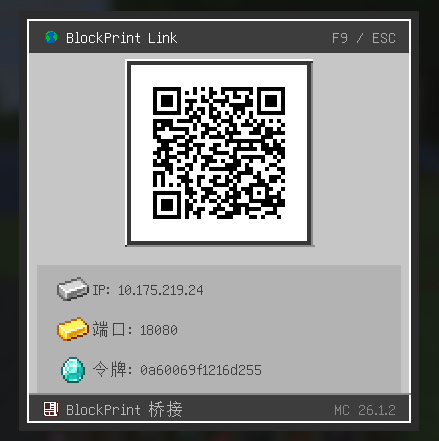

# BlockPrint Link

Minecraft 模组，WebSocket 服务器 + UDP 广播，供 [BlockPrint Cat](https://github.com/moxisuki/blockprint-cat) 浏览蓝图。



## 支持版本

| MC | NeoForge | Forge | Fabric |
|----|----------|-------|--------|
| 1.20.1 | — | ✅ | — |
| 1.21.1 | ✅ | ✅ | ✅ |
| 1.21.4 | ✅ | — | ✅ |
| 1.21.8 | ✅ | — | ✅ |
| 26.1.2 | ✅ | — | ✅ |

## 构建

```bash
./gradlew :neoforge-1_21_1:build
./gradlew :forge-1_20_1:build
./gradlew :fabric-1_21_1:build
```

## 配置

`config/blockprintlink-bridge.toml`：

```toml
[bridge]
token = ""
showChatMessages = true
wsPort = 18080
discoveryPort = 18081
```

F7 打开 QR 码弹窗，`/blockprint-reload` 重载配置。

## 蓝图来源

bridge 自动扫描以下目录并通过 WebSocket 暴露：

| 来源 | 路径 | 启用条件 |
|---|---|---|
| Litematica schematics | `<gameDir>/schematics/` | 始终 |
| 原版结构导出 | `<gameDir>/saves/*/generated/minecraft/structures/` | 始终 |
| WorldEdit schematics | `<gameDir>/config/worldedit/schematics/` | WorldEdit 加载时（classpath 探测） |

WorldEdit 集成**不**作为 Gradle 依赖 —— 仅运行时按需读取默认目录。

## 许可

MIT
